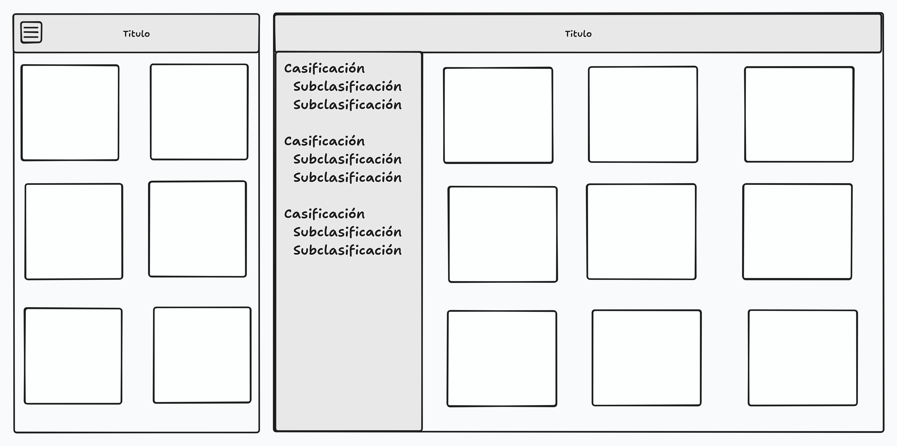

# Escaparate 

## Situación profesional

Crear desde cero un escaparate tipo `dashboard` para ver una lista de productos calasificados, y sus detalles básicos: nombre, descripción, imagen, precio y stock.

## Profesión:

Desarollador Frontend.

## Competencias

Crear una interfaz de usuario web estática y adaptable.

## Necesidad

Necesitamos compartir con el público la lista de productos y/o servicios que nuestro cliente ofrece.

## Modalidad pedagógica

Trabajo en equipo

## Modalidad de evaluación

Revisión de entregables por parte del profesorado.

## Entregables

1. HTML y recursos (imágenes y css) en un repositorio github personal.

2. Documento de tareas repartidas.

3. Documento de equipo que detalle:

CEREMONIA 1:
Analizámos el reto que nos proponen y dejamos claros los siguientes puntos:
HISTORIAS DE USUARIO:

  ÉPICA:
    Realizar una página web con formato dashboard que sea responsive (hamburguesa) y tenga un submenú vertical a la izquierda (aside) con categorías y sub categorías que filtren.

  FUNCIONALIDADES:
    Menú vertical a la izquierda que se convierte en hamburguesa y tiene categorías y subcategorías
    Dashboard: con diferentes artículos
    Header

  COMPONENTES CON SU ROL:
    Diseño prototipo - Orlando
    Tarjeta de producto estructura - Esti
    Tarjeta de producto estilo - Esti
    Header estructura - Esti
    Header estilo - Esti
    Menú vertical formato desktop estructura - Ion
    Menú vertical formato desktop estilo - Ion
    Menú vertical formato mobile estructura - Ion
    Menú vertical formato mobile estilo (media) - Ion
    Enlazar y filtrar - Todos

  NORMAS INTERNAS:
    1) 

  OBJETIVOS DEL EQUIPO:
    1) Optimizar la comunicación asertiva
    2) Mejorar cada uno en nuestros puntos débiles en cuanto a conocimientos técnicos
    3) Continuar adquiriendo conocimientos de cómo trabajar en equipo con Git Hub (ramas)
    4) Analizar historias de usuario en equipo y trabajar en base a ello la retrospectiva y división de tareas

  COMPROMISOS DEL EQUIPO:
    1) Lograr el objetivo final que nos pide el cliente y crear una pagína web a la altura para el usuario.

  SPRINT 1:
  Tiempo establecido: Lunes 8:30 - Miercoles 2:30
  Después de concretar lo que nos piden y lo que vamos a hacer. Creamos un repositorio en el GitHub y creamos un documento HTML con la estructura básica que tendrá el catálogo y las rama (dev). Hicimos push, y desde ahí ya creamos cada uno su rama (menu y card) para empezar a trabajar en lo que se le ha asignado a cada uno.
  Compromisos:
    - Orlando: Buscar como sería el diseño que plantearemos a nuestra web y bocetar
    - Esti: Diseñar las card
    - Ion: Diseñar el menu
  
  DAILY Martes 8:30 (Se decide para el segundo SPRING lo siguiente): 
  Orlando nos muestra el diseño que ha creado y como nos convence a todos decidimos que en vez de tener un menu lateral en desk top y un menu hamburguesa en móviles, crear un botón de filtros que ira situado en el main donde el usuario podra hacer click y entonces aparecera el "menu" lateral con los apartados y subapartados correspondientes. De este modo, el menu desaparece y pasa a ser un botón.

  JORNADA DEL MARTES: Seguimos avanzando con el código para hacer el menu y las cards.
  
  DAILY Miercoles 8:30 (Toca unir las ramas para hacer el JS)
  
  JORNADA DEL MIERCOLES: Finalizamos de hacer las tareas en las ramas menu y card y mergeamos todo en la rama dev para ver como queda y trabajar con JS para vincular las cards a sus correspondientes categorías en el menu. 
  
  FIN DEL SPRINT 1

  CEREMONIA 2: Jueves 8:30 
  Decidimos hacer algún cambio de JS para que el menu desaparezca al hacer la selección de una de las categorías. Por otro lado, 

  - Reflexión:
    - ¿Qué hemos logrado?
    - ¿Cómo lo hemos hecho?
    - ¿Qué no hemos logrado? 
    - ¿Qué mejoraríamos?
    - ¿Cómo lo mejoraríamos?
    - ¿Qué debemos seguir haciendo?
    - ¿Qué debemos empezar a hacer?
    - ¿Qué debemos hacer mejor?
    - ¿Qué debemos dejar de hacer?
    - ¿Qué hemos aprendido?

Para hacer la entrega, el alumnado deberá publicar el enlace al repositorio en el canal 05-escaparate de discord.

## Criterios de rendimiento

- Toda la funcionalidad cubierta.
- Código correctamente indentado y limpio.
- Todos los tags correctamente abiertos/cerrados (https://validator.w3.org/).
- Comentarios de código donde se necesiten.
- Ficheros no-html en directorios aparte.
- Se valorará si se puede ver el avance a través de los commits.
- El conjunto de las tareas han de cubrir la funcionalidad requerida por el cliente.
- Cada commit ha de dejar producto funcional.
- Cada tarea ha de estar asignada a alguien, tener un a estimación en tiempo, y un estado de completitud.
- Ha de estar publicado para poder ver una versión live, y el enlace ha de estar en el README.md 

## Descripción de las funcionalidades a realizar:

El dashboard ha de ser una página responsive que muestre fotografías según una clasificación:

